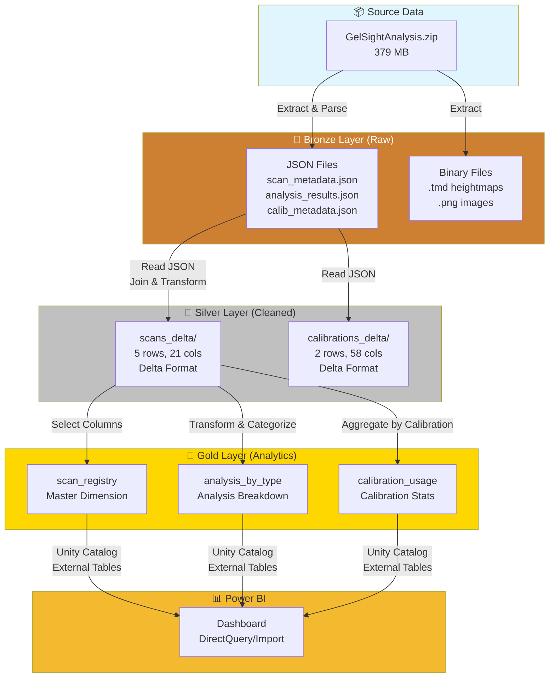
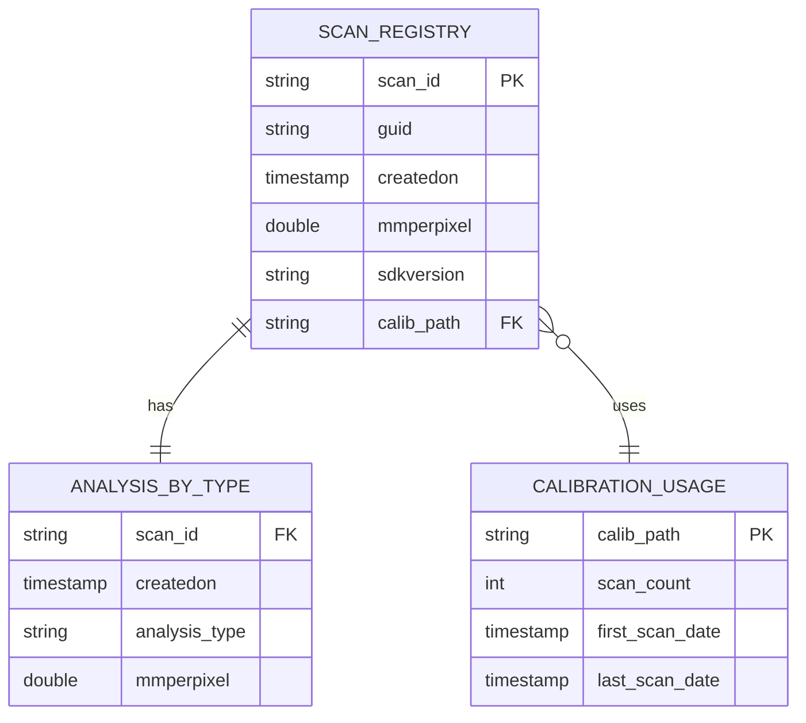
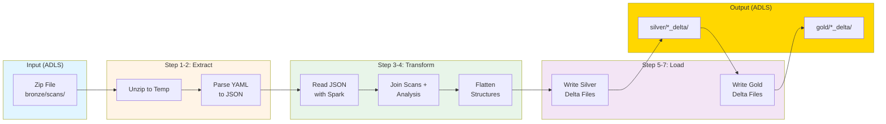
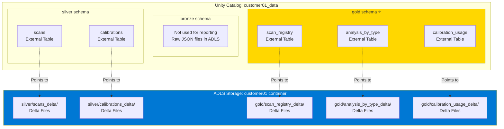

# Power BI Dashboard - Data Modeling Handoff

**Date:** February 20, 2026  
**Project:** GelSight Scan Analysis Pipeline  
**Customer:** customer01  

---

## 1. What You Need to Know

### A. Data Architecture

**Unity Catalog Structure:**
```
customer01_data (catalog)
├── bronze (schema) - Raw JSON files (not for reporting)
├── silver (schema) - Cleaned, queryable data
│   ├── scans (5 rows, 21 columns)
│   └── calibrations (2 rows, 58 columns)
└── gold (schema) - Analytics-ready tables ⭐ USE THESE
    ├── scan_registry (5 rows) - Master dimension
    ├── analysis_by_type (5 rows) - Analysis breakdown
    └── calibration_usage (2 rows) - Calibration stats
```

**Connection Details:**
- **Workspace**: USCU-PROD-DATA-PROCESSING-01
- **Catalog**: `customer01_data`
- **Schema for Reporting**: `gold`
- **Tables to Use**: 
  - `customer01_data.gold.scan_registry`
  - `customer01_data.gold.analysis_by_type`
  - `customer01_data.gold.calibration_usage`

---

## Data Flow Diagrams

### Overall Data Architecture Flow



### Table Relationships (Entity Relationship Diagram)



### ETL Pipeline Flow (nb-ingestion)



### Unity Catalog Structure



---

### B. Table Schemas & Relationships

**`gold.scan_registry` (Master Dimension)**
- `scan_id` (PK) - Unique identifier (DefectDetection, HoleDiameter, etc.)
- `guid` - Scan GUID
- `createdon` - Timestamp when scan was created
- `mmperpixel` - Resolution (mm per pixel)
- `sdkversion` - SDK version used
- `calib_path` - Path to calibration file used (FK to calibrations)

**`gold.analysis_by_type` (Analysis Breakdown)**
- `scan_id` (FK) - Links to scan_registry
- `createdon` - Timestamp
- `analysis_type` - Human-readable type (Defect Detection, Pit Detection, etc.)
- `mmperpixel` - Resolution

**`gold.calibration_usage` (Calibration Stats)**
- `calib_path` (PK) - Calibration file path
- `scan_count` - Number of scans using this calibration
- `first_scan_date` - First time calibration was used
- `last_scan_date` - Last time calibration was used

**Relationships:**
```
scan_registry.calib_path ──→ calibration_usage.calib_path (many-to-one)
scan_registry.scan_id ──→ analysis_by_type.scan_id (one-to-one)
```

### C. Sample Query for Power BI

```sql
-- Complete scan overview with calibration info
SELECT 
    sr.scan_id,
    sr.createdon,
    abt.analysis_type,
    sr.mmperpixel,
    sr.sdkversion,
    sr.calib_path,
    cu.scan_count as calibration_usage_count,
    cu.first_scan_date as calibration_first_used,
    cu.last_scan_date as calibration_last_used
FROM customer01_data.gold.scan_registry sr
LEFT JOIN customer01_data.gold.analysis_by_type abt 
    ON sr.scan_id = abt.scan_id
LEFT JOIN customer01_data.gold.calibration_usage cu 
    ON sr.calib_path = cu.calib_path
ORDER BY sr.createdon DESC;
```

### D. Data Characteristics

**Current Data Volume:**
- 5 scans across 5 analysis types
- 2 calibrations
- Date range: September 2025
- All scans use SDK version 4.2.240

**Analysis Types:**
1. Defect Detection
2. Pit Detection
3. Hole Diameter
4. Offset
5. Surface Roughness

**Calibration Distribution:**
- Calib-4E07-XNJU_20250917_1255: Used by 4 scans
- Calib-436U-Y58K_20250912_0928: Used by 1 scan

---

## 2. Recommended Dashboard Content

### 📈 Page 1: Executive Overview

**KPIs (Top Cards):**
- Total Scans (5)
- Active Calibrations (2)
- Date Range (First to Last Scan)
- Most Common Analysis Type

**Visualizations:**

1. **Scans Over Time** (Line Chart)
   - X-axis: createdon (date)
   - Y-axis: Count of scans
   - Trend: Are scans increasing?

2. **Analysis Type Distribution** (Donut Chart)
   - Values: Count by analysis_type
   - Shows: Which analysis types are most common

3. **Calibration Usage** (Bar Chart)
   - X-axis: calib_path (or extract calibration ID)
   - Y-axis: scan_count
   - Shows: Which calibrations are used most

4. **Scan Timeline** (Gantt/Timeline)
   - Shows: When each scan was performed
   - Color by: analysis_type

### 📊 Page 2: Scan Analysis Details

**Filters (Slicers):**
- Analysis Type (multi-select)
- Date Range
- Calibration Used
- Resolution Range (mmperpixel)

**Visualizations:**

1. **Scan Detail Table**
   - Columns: scan_id, createdon, analysis_type, mmperpixel, sdkversion
   - Sortable, filterable
   - Drill-through to scan details

2. **Resolution Distribution** (Histogram)
   - X-axis: mmperpixel (binned)
   - Y-axis: Count of scans
   - Shows: What resolutions are commonly used

3. **Scans by Analysis Type** (Stacked Bar)
   - X-axis: Date (grouped by week/month)
   - Y-axis: Count
   - Stack by: analysis_type
   - Shows: Trends in analysis types over time

### 🔧 Page 3: Calibration Management

**Purpose:** Track calibration usage and identify when recalibration is needed

**Visualizations:**

1. **Calibration Timeline** (Gantt)
   - Shows: first_scan_date to last_scan_date for each calibration
   - Highlights: Calibrations in use for long periods (may need refresh)

2. **Scans Per Calibration** (Bar Chart)
   - X-axis: Calibration ID
   - Y-axis: scan_count
   - Alert: If scan_count > threshold, flag for recalibration

3. **Calibration Age** (Card/KPI)
   - Days since calibration was created
   - Alert: If > 30 days, recommend recalibration

4. **Scan-to-Calibration Matrix** (Table)
   - Rows: scan_id
   - Columns: calib_path, createdon, days_since_calibration
   - Shows: Which scans used which calibrations

### 🔍 Page 4: Quality & Traceability

**Purpose:** Audit trail and quality assurance

**Visualizations:**

1. **Scan Audit Trail** (Table)
   - scan_id, createdon, analysis_type, calib_path, sdkversion
   - Exportable for compliance

2. **SDK Version Distribution** (Pie Chart)
   - Shows: Which SDK versions are in use
   - Alert: If multiple versions, flag for standardization

3. **Resolution Consistency** (Scatter Plot)
   - X-axis: createdon
   - Y-axis: mmperpixel
   - Shows: If resolution is consistent across scans

### 📌 Page 5: Drill-Through Details

**Triggered from:** Clicking a scan in any visualization

**Shows:**
- Scan ID
- Created On
- Analysis Type
- Resolution (mmperpixel)
- SDK Version
- Calibration Used
- Calibration Age (days)
- Calibration Usage Count

---

## 3. Advanced Features (Future)

### When More Data is Available:

**Predictive Analytics:**
- Predict when calibration needs refresh (based on scan count, age)
- Forecast scan volume trends

**Quality Metrics:**
- If shapes/routines JSON data is parsed:
  - Defect counts over time
  - Surface roughness trends
  - Hole diameter accuracy

**Multi-Customer Comparison:**
- When customer02, customer03 data is added:
  - Compare scan volumes across customers
  - Benchmark analysis types
  - Calibration usage patterns

---

## 4. Power BI Connection Setup

### Option A: DirectQuery (Recommended)

**Data Source:** Databricks  
**Server:** <workspace-url>  
**HTTP Path:** <cluster-http-path>  
**Catalog:** customer01_data  
**Schema:** gold  
**Authentication:** Azure AD or Personal Access Token  

**Pros:**
- Always shows latest data
- No data refresh needed
- Real-time dashboard

### Option B: Import Mode

Same connection, but import data into Power BI  
**Schedule refresh:** Daily/Hourly  

**Pros:**
- Faster dashboard performance
- Works offline

**Cons:**
- Requires scheduled refresh
- Data may be stale

---

## 5. Key Metrics to Track

| Metric | Calculation | Business Value |
|--------|-------------|----------------|
| **Scan Volume** | COUNT(scan_id) | Operational activity |
| **Calibration Utilization** | scan_count per calibration | Identify overused calibrations |
| **Calibration Age** | DATEDIFF(NOW(), first_scan_date) | Flag old calibrations |
| **Analysis Type Mix** | % by analysis_type | Understand workload distribution |
| **Resolution Consistency** | STDEV(mmperpixel) | Quality control |
| **Scan Frequency** | Scans per day/week | Capacity planning |

---

## 6. Sample DAX Measures

```dax
// Total Scans
Total Scans = COUNTROWS('scan_registry')

// Average Scans Per Day
Avg Scans Per Day = 
DIVIDE(
    COUNTROWS('scan_registry'),
    DATEDIFF(MIN('scan_registry'[createdon]), MAX('scan_registry'[createdon]), DAY)
)

// Calibration Age (Days)
Calibration Age = 
DATEDIFF(
    MIN('calibration_usage'[first_scan_date]),
    TODAY(),
    DAY
)

// Most Used Calibration
Most Used Calibration = 
CALCULATE(
    MAX('calibration_usage'[calib_path]),
    TOPN(1, 'calibration_usage', 'calibration_usage'[scan_count], DESC)
)
```

---

## 7. Handoff Checklist

### Provide:
- [ ] Databricks workspace URL
- [ ] Cluster HTTP path (for Power BI connection)
- [ ] Authentication credentials (Azure AD or PAT)
- [ ] This documentation
- [ ] Sample SQL queries

### Verify:
- [ ] Data modeling expert can connect to Databricks
- [ ] Gold tables are accessible
- [ ] Sample query returns data

### Next Steps:
- [ ] Data modeling expert builds dashboard
- [ ] Review dashboard with stakeholders
- [ ] Schedule data refresh (if using Import mode)
- [ ] Set up alerts for calibration age, scan volume

---

**Document Created:** February 20, 2026  
**Last Updated:** February 20, 2026  
**Contact:** Data Engineering Team
